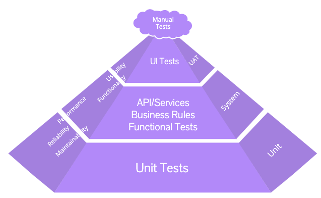
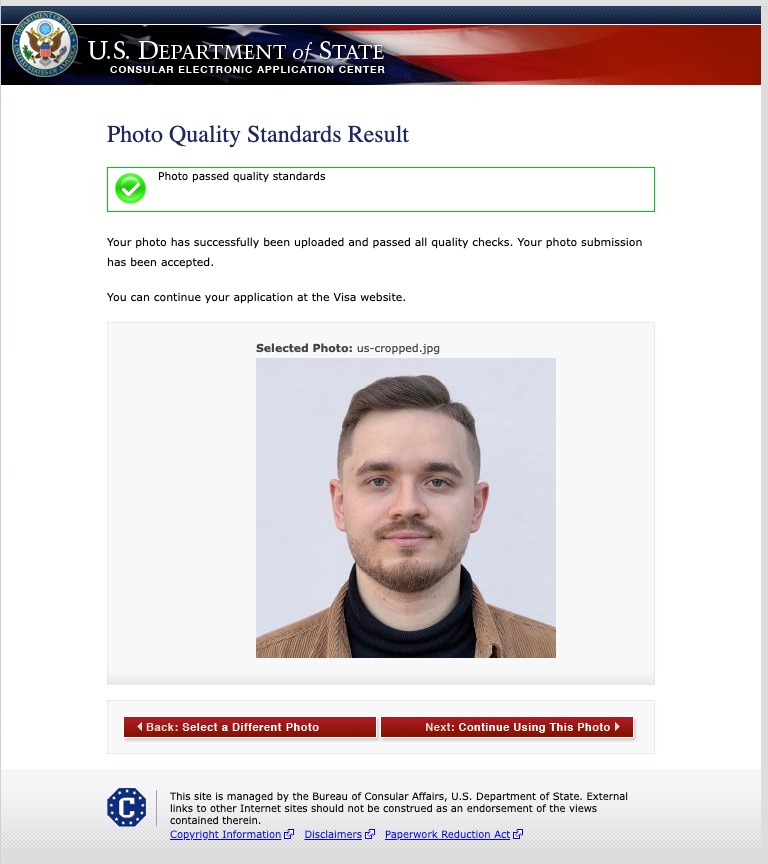
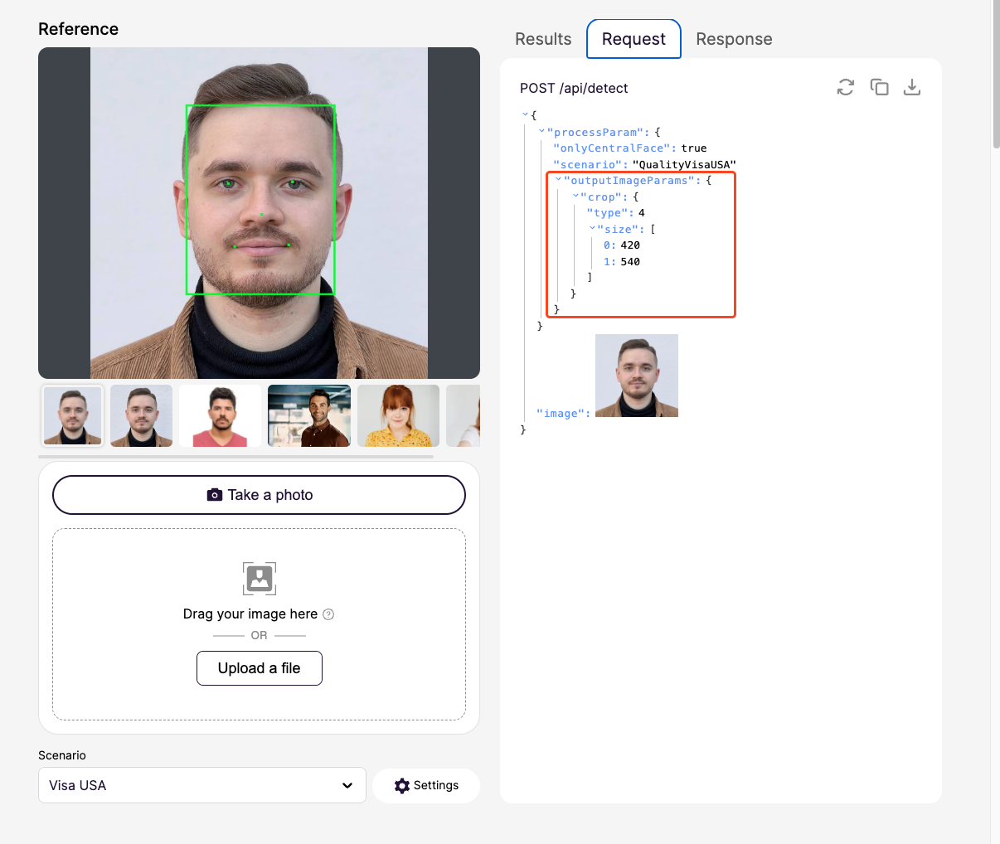

# Regula Face Image Quality – Tests (Playwright + TypeScript).

**Getting Started**
- Install dependencies: `npm ci`
- Install browsers: `npm run install:browsers`
- Set `BASE_URL` if needed (defaults to Regula demo host):
  - macOS/Linux: `export BASE_URL=https://your-host`
  - Windows (PowerShell): `$env:BASE_URL='https://your-host'`

**Run Tests**
- All: `npm test`
- API/functional only: `npm run test:api`
- UI only: `npm run test:ui`
- View last report: `npm run report`

**Configuration**
- Base URL is defined once and reused by UI and API:
  - `src/utils/config.ts:1`
  - `config/playwright.config.ts:1`
- Viewport and scaling force deterministic 1920×1080 rendering (HiDPI friendly):
  - `config/playwright.config.ts:1`

**Testing Pyramid**
- Reference image:

  

**Possible Defects**
- `us-cropped.jpg`, which passes the [official US DS‑160 tool](https://identix.state.gov/qotw/Upload.aspx?HxN7f+rphtzSVgnEjcxo6MpbhLFt1fIGhSe3Mc+buMPe0xLHuoCNp8V2d4y5yScw), is marked as "non‑compliant" by the API.

  

- At the same time, the US‑cropped photo — which at minimum does not follow the required ratio — is reported as "compliant" for the Schengen scenario.

- Regarding the UI for the US scenario, unexpected parameters (e.g., crop) appear (see screenshot below). If ICAO requires cropping, that makes sense; however, for the US visa should the original photo be validated instead? And if cropping is applied, should it be 600×600 as stated in the [US official photo requirements](https://travel.state.gov/content/travel/en/us-visas/visa-information-resources/photos.html) and in the Regula scenario documentation?

  

- There are several inconsistencies between the [Face API page](https://faceapi.regulaforensics.com/) and the [Web API documentation](https://dev.regulaforensics.com/FaceSDK-web-openapi/#tag/match/operation/detect), like different expetations to response fields. Is this expected, or a sandbox/production incosistency?
